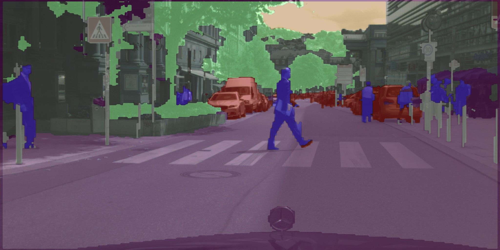

Implementing Unet paper for the CityScape finely annotated dataset.
The mean IOU over all classes is 76% on the validation dataset (7 classes).
## Unet model + Cityscape dataset

[Demo1 vid](https://youtu.be/hwukQZ1rUAo)

[Demo2 vid](https://youtu.be/bpUPKiHMvVY)

[Demo3 vid](https://youtu.be/vBCH5Pkt5y8)
